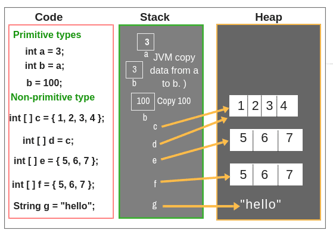

# Array Syntax -java

## 1. Arrays are objects in java


```
public class Sample1 {

    // Three ways of Initializing Arrays in java.
    public static void main(String[] args) {
        int[] arr1= new int[]{1,2,3,4,5};
        for(int i=0;i<arr1.length;i++){
            System.out.print(arr1[i]);
        }

        System.out.println("\n");


        int[] arr2=new int[5];
        arr2= new int[]{1,3,5,7,9};
        for(int i=0;i<arr2.length;i++){
            System.out.print(arr2[i]);
        }


        System.out.println("\n");

        int[] arr3={2,4,6,8,0};
        for(int i=0;i<arr3.length;i++){
            System.out.print(arr3[i]);
        }


        //copying an array
        array2=array1.clone();

        //Sorting arrays
        Arrays.sort(array); -----> java.util.Arrays 

        //Arrays.equals(arr1,arr2); checks if two arrays have (same elements / same order)

        //Arrays.copyOf(oldArr,5); creates a new array of size (5) and copy elements

        //Arrays.fill(arr,2); fill all values with 2
    


    }
}


```
Stack        Heap
arr -------> [10,20,30]

```


